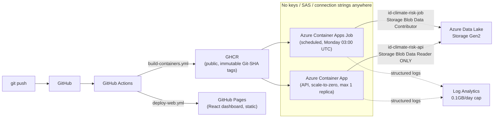
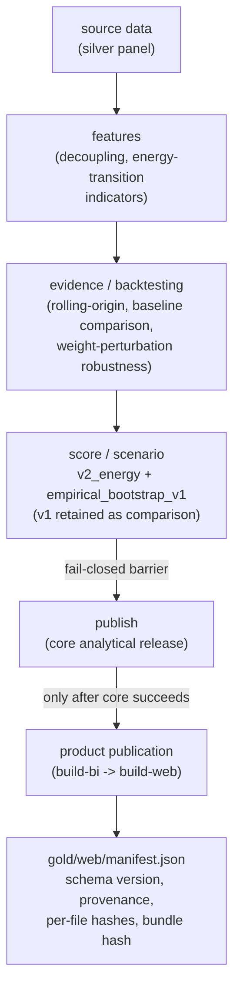

# System architecture

Three complementary views: what data flows through (system), what runs
where in Azure (deployment), and how raw numbers become a published risk
score (analytical flow). Diagrams are Mermaid so they stay in Git as text
and render on GitHub.

## A. System architecture

```mermaid
flowchart LR
    subgraph sources["Public sources"]
        owid_co2["OWID CO2"]
        wdi["World Bank WDI"]
        owid_energy["OWID Energy"]
    end

    sources -->|ingestion adapters| raw["raw/\ncontent-hashed, never overwritten"]
    raw -->|dedupe, normalise| bronze["bronze/\nper-source curated tables"]
    bronze -->|dimension model,\nunit normalisation| silver["silver/\ncountry-year panel"]
    silver --> analytics["analytics\n(features, scoring, scenarios,\nbacktesting)"]
    analytics -->|fail-closed publish| gold["gold/\nversioned analytical release"]
    gold -->|build-bi| goldbi["gold/bi/\nBI-shaped tables"]
    goldbi -->|build-web| goldweb["gold/web/\nchecksummed JSON bundle"]
    goldweb --> api["Read-only FastAPI"]
    goldweb --> web["React dashboard"]
```

## B. Deployment architecture

## C. Analytical flow

A product-publication failure (the last step) is reported loudly but never
rolls back or corrupts a valid core `publish` — the two layers fail
independently (ADR 0019).

## Notes on what this diagram deliberately omits

- **Power BI** (`powerbi/`) is preserved as engineering history — a
  superseded prototype route, not part of the canonical v1 architecture.
  See ADR 0015/0016 for why the canonical product moved to React.
- **No Azure Container Registry** — GHCR is public and free; ACR would add
  cost for no benefit here.
- **No database** — every artifact is a file in ADLS Gen2 (Parquet in
  `gold/bi`, JSON in `gold/web`); the API reads directly from storage, it
  does not run a query engine.
